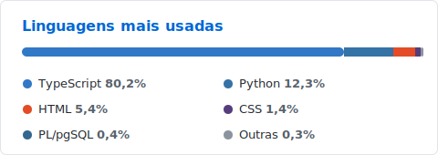

<h1>Naif Mardine</h1>

<b>Administração @ FGV</b> &nbsp;·&nbsp; Consultoria e Mercado Financeiro

  Sou estudante de Administração na FGV e atuo como Digital Dev na FGV Jr. O que me move é o encontro entre negócios e tecnologia: gosto de transformar conceitos que estudo, como valuation, estatística e estratégia, em ferramentas que funcionam na prática. É para a consultoria e o mercado financeiro que pretendo direcionar esse trabalho.

  
   
  

<h4>Contato</h4>

  <a href="https://www.linkedin.com/in/naifmardine/">LinkedIn</a>
   
  <a href="https://github.com/naifmardine">GitHub</a>
   
  <a href="mailto:naifmmardine@gmail.com">Email</a>

<h3 align="center">Com o que eu trabalho</h3>

  
  
  
  
  

   

  
  
  
  
  

    

  
  
  
  
  
  
  

